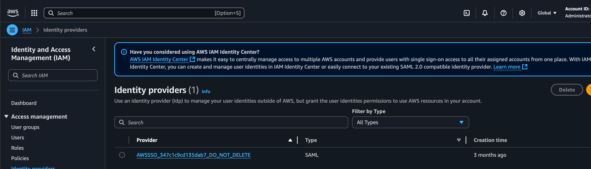
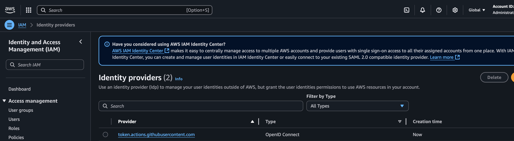

= Setup

This is making the assumption that all accounts involved are being setup/configured for the first time, in the event that is not the case, some of these steps may be optional.

== Step 0: Configure Aws and GitHub OIDC (Possibly Optional)

[NOTE]
It is possible that IT has already taken care of this step for the account, but if not, these are instructions on how to correctly configure Aws and GitHub to talk to one another.

[IMPORTANT]
This Terraform project is intended to be executed from a developers machine NOT from CI/CD. This project should only have to be run A SINGLE TIME unless something has gone catastrophically wrong or some form of connection update becomes necessary in the future.

To start, make sure you are in the base project directory of `dpc-base-cloud-resources` then `cd terraform/aws/aws-github-oidc-setup`. This is the very first thing that will need to be configured, and it only needs to be configured *ONCE* for *ALL* Aws accounts. This project configures exactly one thing and one thing only, and that is the authentication between Aws and GitHub.

To see the before state in Aws Console, navigate to IAM -> Identity Providers and you should see something similar to the following ...

Now execute the following commands from inside the `aws-github-oidc-setup` project ...

* `aws sso login` - make sure you are authenticated to Aws otherwise you will receive an error
** Note: Terraform can see Aws is logged in via this line `shared_config_files      = ["~/.aws/config"]` in the `provider.tf` file
** Warning: This variant is only used on projects that are not intended to be executed through CI/CD!
* `terraform init` - initialize the project
* `terraform validate` - check that terraform is valid
* `terraform fmt` - make sure terraform is formatted correctly
* `terraform plan` - dry run and review the changes that will be made
* `terraform apply` - if you are good with the changes, apply them
* Answer `yes` - confirm you are good with the changes

Now if you again navigate in Aws Console to IAM -> Identity Providers and you should see something similar to the following ...

=== Managing the state of this project

This project is a bit of "the exception to the rule" and I don't really like that, but there isn't a way around it at this point. As this project is executed from a developers machine that means the `tfstate` is being maintained locally on the execution machine. This is not good as others can not work on this project in that case and that `tfstate` file could be lost (especially given that this project will not be executed often). To remedy this, the state should be stored in S3, but we are not setup yet to do this. Continue on to the next step, and we will return here to finish managing this state after "Step 1" has been completed.

[WARNING]
Do not continue unless "Step 1" has been completed!!!

Once "Step 1" has been completed, execute the following to store the state in S3.

* Open `terraform.tf` in the `aws-github-oidc-setup` project and uncomment the `backend "s3"` block
* Update the bucket name with the name of the bucket created in "Step 1"
** The bucket name will be returned in the outputs from the execution of "Step 1"
* Execute `terraform init -migrate-state`
** This will move the state file into the S3 bucket for storage and will allow the state to be available to multiple developers

== Step 1: Configure the base "Account" resources

[IMPORTANT]
This Terraform project is intended to be executed from a developers machine NOT from CI/CD. This project should only have to be run once in a blue moon. If this project is being run, that means either *MAJOR* infrastructure changes are taking place or something terrible happened.

[CAUTION]
This project *MUST* be executed _per_ account. I.E. it must be run against tools, np, and prod separately. This project contains sub-folders for each account. It will configure the same resources in each account to support the CI process. `tfstate` files will be stored in the *account* in which the CI job runs against (if the CI job runs for NP then the state files will be stored in the NP account).

With Aws and GitHub now connected, it is time to set up the base account resources that will be used by all projects in a given space.

To start, make sure you are in the base project directory of `dpc-base-cloud-resources` then `cd terraform/aws/dpc-base-cloud-resources`. This project will configure the following infrastructure ...

* Creates S3 bucket to hold `tfstate` files
** S3 bucket name will be generated with a unique value to ensure the naming convention does not have issues with S3 buckets being "Global" in Aws
* Creates Aws System Manager property (SSM) that contains the S3 bucket name for reference in other projects and build actions.
* Creates IAM role for GitHub Action to assume during execution
* Sets ARN value of created role in GitHub repository secrets for reference during GitHub Action execution

Now execute the following commands from inside the `dpc-base-cloud-resources` project ...

* `aws sso login` - make sure you are authenticated to Aws  otherwise you will receive an error (optional if you are already logged in)
** Note: Terraform can see Aws is logged in via this line `shared_config_files      = ["~/.aws/config"]` in the `provider.tf` file
** Warning: This variant is only used on projects that are not intended to be executed through CI/CD!
* `terraform init` - initialize the project
* `terraform validate` - check that terraform is valid
* `terraform fmt` - make sure terraform is formatted correctly
* `terraform plan` - dry run and review the changes that will be made
* `terraform apply` - if you are good with the changes, apply them
* Answer `yes` - confirm you are good with the changes

=== Managing the state of this project

This project is also a bit of "the exception to the rule", and there also isn't a way around it at this point. As this project is executed from a developers machine that means the `tfstate` is being maintained locally on the execution machine. This is not good as others can not work on this project in that case and that `tfstate` file could be lost (especially given that this project will not be executed often). To remedy this, the state should be stored in S3, but we are not setup yet to do this. Once this step (Step 1) has been executed, modifications will be made to the project in order to store the state in a universal location.

Now having executed `dpc-base-cloud-resources` go back and execute the following to store the state in S3.

* Open `terraform.tf` in the `dpc-base-cloud-resources` project and uncomment the `backend "s3"` block
* Update the bucket name with the name of the bucket created in "Step 1"
** The bucket name will be returned in the outputs from the execution of "Step 1"
* Execute `terraform init -migrate-state`
** This will move the state file into the S3 bucket for storage and will allow the state to be available to multiple developers

[TIP]
At this point, please return to "Step 0 ... Once "Step 1" has been completed" and get its state stored in S3.

== Migrating state back to a local machine from S3

In the event, you need to migrate the state _back_ to a local machine to execute the following ...

* Open `terraform.tf` in the terraform project folder and comment out the `backend "s3"` block
* Execute `terraform init -migrate-state`

Now the state should be back on the local machine, and it should be possible to delete the state manually from the S3 bucket.

== Reference

* https://registry.terraform.io/providers/hashicorp/aws/latest/docs#shared-configuration-and-credentials-files
* https://docs.aws.amazon.com/cli/latest/userguide/cli-configure-sso.html#sso-configure-profile-auto
* https://dev.to/sepiyush/using-terraform-to-manage-resources-in-multiple-aws-accounts-1b61
* https://hector-reyesaleman.medium.com/terraform-aws-provider-everything-you-need-to-know-about-multi-account-authentication-and-f2343a4afd4b
* https://github.blog/changelog/2023-06-27-github-actions-update-on-oidc-integration-with-aws/
* https://docs.aws.amazon.com/IAM/latest/UserGuide/id_roles_providers_create_oidc_verify-thumbprint.html
* https://registry.terraform.io/providers/hashicorp/aws/latest/docs/resources/iam_openid_connect_provider.html

